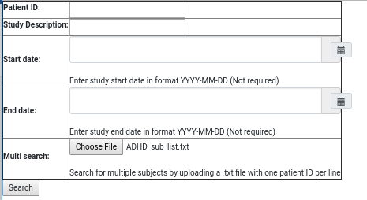

# Bids Tryworks 
## Description:
Bids Tryworks is a gui resource designed to convert a set of dicoms into a [BIDS](https://bids.neuroimaging.io/) 
dataset. BIDS is an acronym for Brain Imaging Data Structure, if you wish to know more about BIDS I would recommend 
reading up on the official website linked above. TL;DR BIDS formatted data consists of dicoms that have been converted 
into nifti's (compressed or uncompressed) and then labeled, named, and organized into a standard pattern. Additional 
information on the BIDS spec can be found [here](https://bids-specification.readthedocs.io/en/stable/).

## Technologies
Bids Tryworks is built with python, dcm2niix, django, docker, and JavaScript.
- Python
    - Conversion from dicoms to bids is accomplished via: [dcm2bids](https://github.com/cbedetti/Dcm2Bids). 
    - [github page](https://github.com/rordenlab/dcm2niix)
    - dcm2niix must be installed for dcm2bids to work. 
- Django
    - Handles the interface between the front and backend of Bids Tryworks
    - Indexes and stores information on dicom source folder
- JavaScript
    - most of the front end functionality is written in JS and is pending a rewrite into Vue.

## Installation
There are two methods for installation, the easier of the two requires docker and is the first detailed below:

#### Docker
1) obtain source code via:  `git clone git@github.com:DCAN-Labs/bids-tryworks.git`
2) Copy `bids_tryworks/sample.env` to a new `.env` file. This is where you'll set up bids_tryworks to work on your specific system
3) Your config (`.env`) file should appear like this: 
```
# code folder var, aka where the top level of bids_tryworks is.
CODE_FOLDER=
# Folder containing dicoms to index/convert
BASE_DICOM_DIR=
# Folder to convert dicoms to nifti/bids in, conversions occur here, but
# they don't necessarily stay in this location after conversion is done.
CONVERTED_FOLDER=
# Logs (if you've implemented them yet are stored here
LOG_FOLDER=
# intermediary files for conversion (aka the config json that dcm2bids needs) are stored here
DCM2BIDS_FILES=
# Group and user ids
UID=
GID=
POSTGRES_PASSWORD=password
POSTGRES_USER=postgres
```
The empty variables above (`CODE_FOLDER`, `BASE_DICOM_DIR`, `CONVERTED_FOLDER`, `LOG_FOLDER`, `DCM2BIDS_FILES`)
need to be filled in with paths on your local system. These paths will then be mounted into the docker image
and used during the conversion/processing of your images. These fields are further described in order of 
importance below:
- `CODE_FOLDER` this is the path to this cloned repo
- `BASE_DICOM_DIR` this is where dicoms reside on your system.
- `CONVERTED_FOLDER` an intermediary folder 

Note: You can obtain your UID (user ID) and GID (Group ID) by using the command `id`

#### Non-Docker
- `git clone git@github.com:DCAN-Labs/bids-tryworks.git`
- `git pull`
- `virtualenv venv --python=<your python 3 path>`
- `source venv/bin/activate`
- Optional: edit requirements.txt to reflect most up-to-date versions of packages you have installed on your system
- `pip install -r requirements.txt`
- `python manage.py makemigrations`
- `python manage.py migrate --run-syncdb`
- index path using `python indexer.py`

## Use
### Starting the App
#### Non-Docker Install
- to start the application `python manage.py runserver <Your preferred port: eg 8888>`
- Open a webrowser and navigate to localhost:<Your preferred port>/dicoms/search
#### Docker Install
- Once you've set up your `.env` file as described above simply run docker-compose up in the projects parent
directory
- If everything is successful you'll be able to navigate to http://localhost:8770/dicoms/ to reach the app.
### Locating Subjects/Sessions for Conversion (Search Page)

- Then type in your sub-ID, and any other project information to help find your subjects
- If you wish to search for the same list of subjects simply upload a text file with one subject per line using the 
`Choose File` button in the `Multi Search` row of the search table. Subject lists should have 
[this](images/subject_list.png) formatting.
### Subject/Session Selection
Once your execute your search you'll arrive at the page below.

Here you can select some, none, or all of the subjects that turned up as a result from your
search. Once you've made your selection click on the `Choose These Sessions` button to head
to the next page to convert these subjects. 
### Subject Conversion 
#### Building a Conversion Form/Reusing a Conversion Form
When you first arrive at the conversion page you will be greated with something resembling 
the following:

#### Reusing a Previously Saved Conversion File
If you wish to re-use a previously created conversion file simple selected from the drop down here:

#### Creating a New Conversion File
Otherwise, if you wish to build a new file select the checkbox at the top 
of the page labeled `Create New Conversion File`. Doing so should make
something like the following appear on your page:


## Transferring Converted Subjects
Once you've built your conversion file with the above you'll need to pick 
a destination to deliver your subjects to. Once you've filled in the 
following fields with the appropriate values bids_tryworks will begin to 
convert your dicoms into bids and deliver them.

The fields below need to filled as followed:
- Output Folder Name For This Session
    - This will be the parent folder for all sessions selected during this
    conversion.
- Name for new Config
    - The name you wish to save your newly created conversion file to,
    you can ignore if you're reusing a previously created conversion file.
- Remote Server
    - this can be either the local or a remote server you wish to move the
    converted session files to. Even if you're moving the files locally
    you need to fill out this field with your machine's hostname. Filling
    out this field and the user fields below helps to ensure your converted
    files end up with the correct file permissions on their arrival to
    their output destination
- Username
    - Use the username of the remote/destination folder you're delivering
    these files to.
- Password
    - the Password associated with the username entered above. Note:
    passwords are not stored within this application.


To start your conversion click the `create conversion file` button and wait. You'll recieve a message once all of your conversions are done.


python manage.py migrate --run-syncdb
